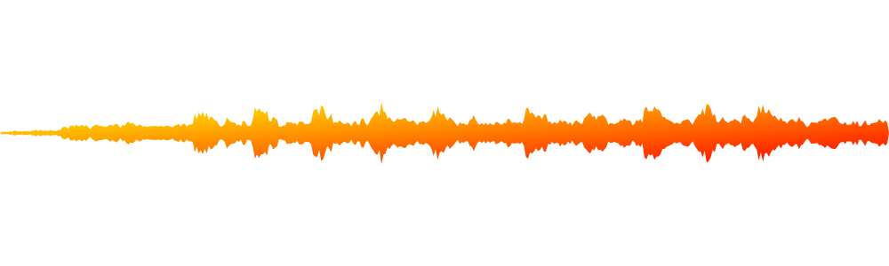

# Node Waveform SVG Generator

This will read an audio file and output an SVG of the waveform of that audio
file.

## Usage

First do a `npm i`.

`npm run waveform-windows --filename=audio.mp3 --width=500 --height=200`

Use `npm run waveform-nonwindows` otherwise.
